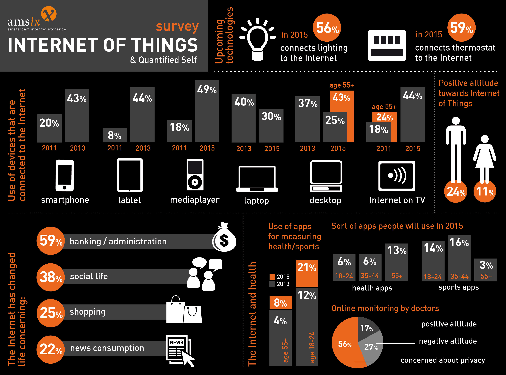

# 前端为何开发

前端开发者通常使用前端技术书写HTML、CSS以及JS代码，并运行在以下操作系统中：

* Windows
* Windows Phone
* OSX
* iOS
* Android
* Ubuntu （或者类似的）
* Chromium

这些操作系统通常运行在下列设备中：

* 桌面电脑
* 便携式 / 笔记本电脑
* 移动电话
* 平板电脑
* 电视
* 手表
* 其他东西（比如…任何你能想象到的，车、冰箱、灯、恒温器等等…）

<cite>图片来源：<a href="https://ams-ix.net/newsitems/87">https://ams-ix.net/newsitems/87</a></cite>

总的来说，前端技术可以在上述系统和设备中，于下列场合中运行：

* 网络浏览器（比如[Chrome, IE, Safari, Firefox](http://outdatedbrowser.com/en))
* [无头浏览器](https://en.wikipedia.org/wiki/Headless_browser)（比如[phantomJS](http://phantomjs.org/)）由操作系统中的CLI驱动
* [网络视图](http://wiki.awesomium.com/general-use/introduction-to-web-views.html)/内嵌于原生应用中的浏览器，作为原生接口运行桥梁。UI都是基于网络的（比如 [Apache Cordova](https://cordova.apache.org/)， [NW.js](http://nwjs.io/), [Electron](http://electron.atom.io/)）
* 使用网络技术构建的原生应用，UI是基于本地的（比如[NativeScript](https://www.nativescript.org/)， [React Native](https://facebook.github.io/react-native/)）

 

