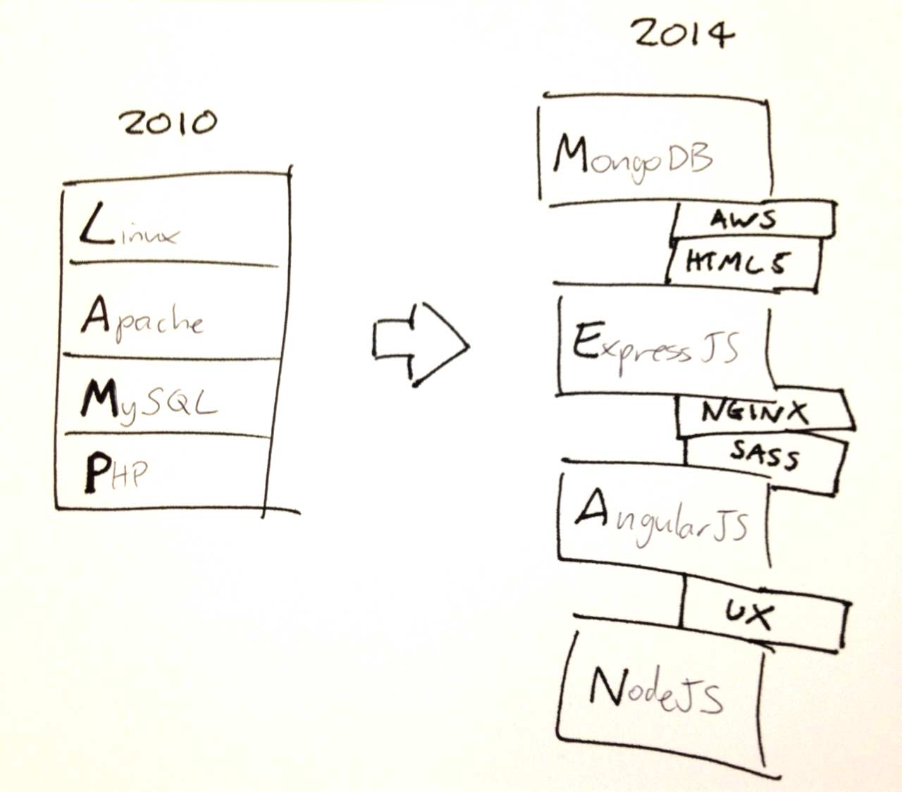

# 通才迷思

<cite>图片来源：<a href="http://andyshora.com/full-stack-developers.html">http://andyshora.com/full-stack-developers.html</a></cite>

设计开发网络解决方案的角色需要在视觉设计、UI/交互设计、前端开发、后端开发中的某个领域具有深入的技巧和大量的经验。任何人能够在这4个角色中的一个或多个中达到精通等级（也就是通才，或者全栈开发/设计）都是非常罕见的。

务实的讲，你应该努力成为、或努力雇佣某一方面的专家。那些声称自己在多方面都极为精通的人是极为罕见的，说是神话倒更可信。

<cite>图片来源：<a href="http://andyshora.com/full-stack-developers.html">http://andyshora.com/full-stack-developers.html</a></cite>

 

