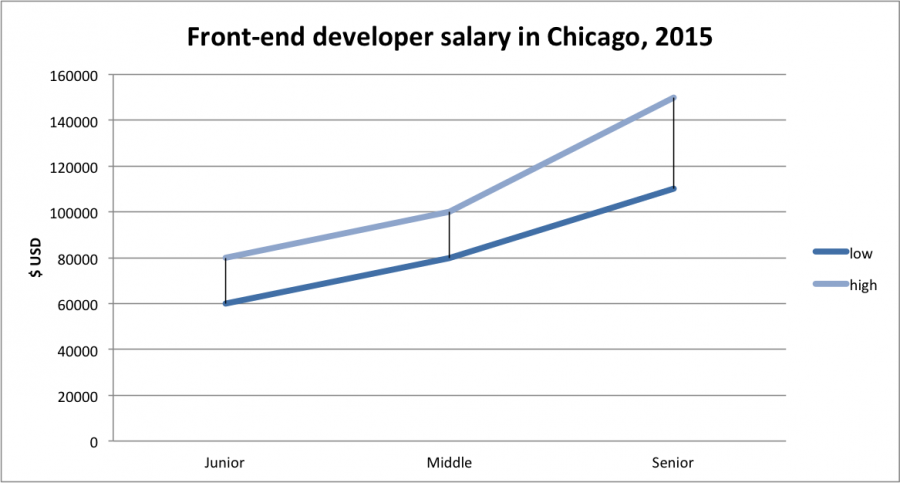

# 前段工资

美国前端开发的全国平均工资是 [$75k](http://www.glassdoor.com/Salaries/front-end-web-developer-salary-SRCH_KO0,23.htm)。

有经验的前端工程师有居住在任何地方的潜力（即远程工作），年薪可以超过 $150k （参见 [angel.co](https://angel.co/jobs) ，登陆，查看年薪超过 $150k 的职位）

<cite>图片来源：<a href="http://intersog.com/blog/chicago-tech-salary-guide-2015/">http://intersog.com/blog/chicago-tech-salary-guide-2015/</a></cite>

 

